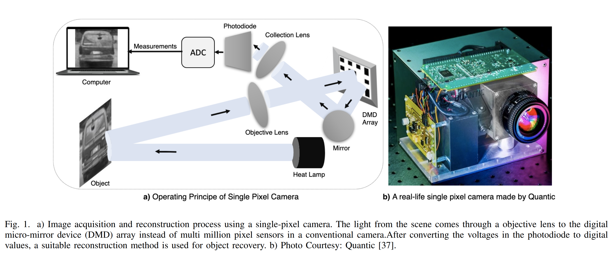
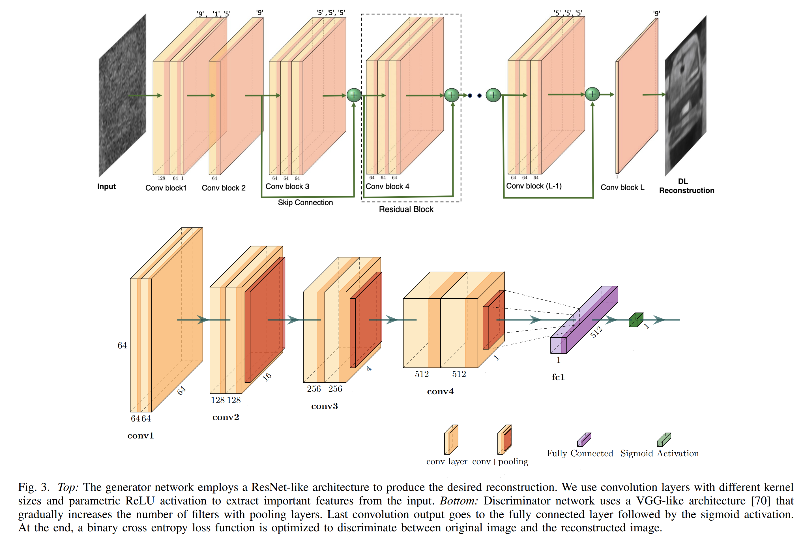
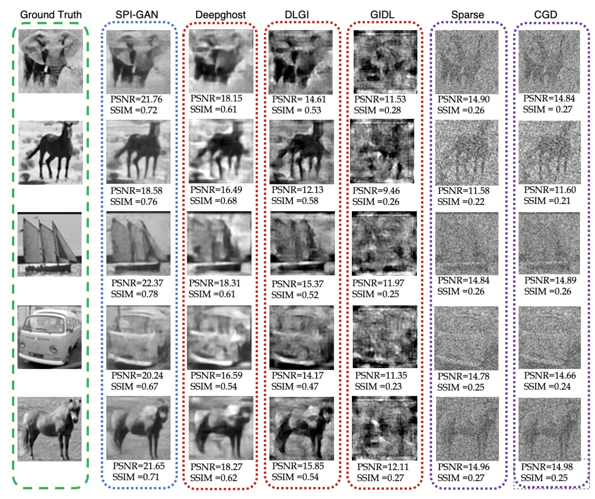
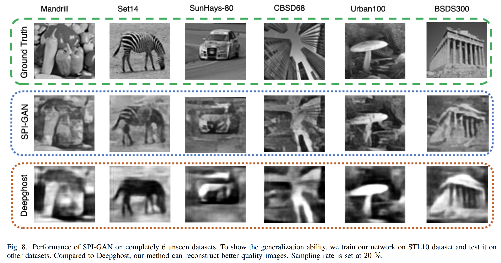
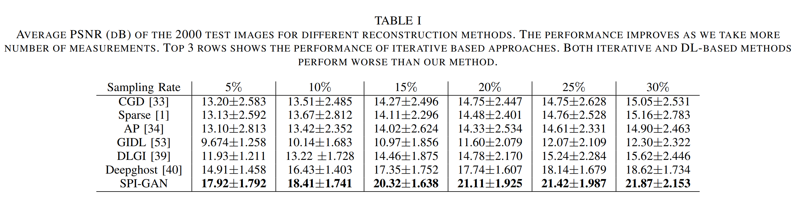

<h2 align="center"> <a href="https://github.com/nazmul-karim170/SPI-GAN-Deep_Learning-Single-Pixel-Camera">SPI-GAN: Towards Single-Pixel Imaging through
Generative Adversarial Network</a></h2>
<h5 align="center"> If you like our project, please give us a star ⭐ on GitHub for the latest update.  </h2>

<h5 align="center">

[](https://arxiv.org/pdf/2107.01330.pdf)
[](https://github.com/nazmul-karim170/SPI-GAN-Deep_Learning-Single-Pixel-Camera/blob/main/LICENSE) 


</h5>

## [Paper](https://arxiv.org/pdf/2107.01330.pdf) 

## What is a Single-Pixel Camera? 


## 😮 Highlights
We design a novel DL-based reconstruction framework to tackle the problem of high-quality and fast image recovery in single-pixel imaging


### 💡 Fast, High-quality Image and Video Reconstruction
- Deep Learning for Reconstruction instead of traditional L1-norm solution   -->   Fast Reconstruction 
- Generative Adversarial Network (GAN) as the recovery architecture --> High-quality
- In addition to adversarial and MSE loss, we use a perceptual loss function using the feature space of a pre-trained ImageNet Encoder --> Helps to achieve SOTA performance


## 🚩 **Updates**

Welcome to **watch** 👀 this repository for the latest updates.

✅ **[2023.12.18]** : We have released our code!

✅ **[2021.07.21]** : We have released our paper, SPI-GAN on [arXiv](https://arxiv.org/pdf/2107.01330.pdf).


## 🛠️ Methodology

### Proposed Framework

Our proposed SPI-GAN framework mainly consists of a generator that takes the noisy l2-norm solution (xˆ_noisy) and produce a clear reconstruction
(xˆ) that is comparable to x. On the other hand, a discriminator learns to differentiate between x and xˆ in an attempt to not to be fooled by the generator.

### Architecture 



## Code for Training
Implementation of SPI-GAN: Towards Single-Pixel Imaging through Generative Adversarial Network

1. First download the STL10 and UCF101 datasets. You can find both of these datasets very easily. 
			 
2. If you Want to Create the images that will be fed to the GAN, Run Matlab code "L2Norm_Solution.m" for generating the l2-norm solution. Make Necessary Folders before run. I will also upload the python version of this in future.  		
		
3. Execute this to create the .npy file under different settings

   
	```bash
	   python save_numpy.py
	```

5. For Training-
	
	```bash
	   python Main_Reconstruction.py
	```

### Data Preaparation for Video Reconstruction: UCF-101

* Download videos and train/test splits [here](http://crcv.ucf.edu/data/UCF101.php).
* Convert from avi to jpg files using ```util_scripts/generate_video_jpgs.py```

	```bash
	python -m util_scripts.generate_video_jpgs avi_video_dir_path jpg_video_dir_path ucf101
	```

* Generate annotation file in json format similar to ActivityNet using ```util_scripts/ucf101_json.py```
  * ```annotation_dir_path``` includes classInd.txt, trainlist0{1, 2, 3}.txt, testlist0{1, 2, 3}.txt

	```bash
	python -m util_scripts.ucf101_json annotation_dir_path jpg_video_dir_path dst_json_path
	```

## 🚀 Reconstruction Results

### Qualitative comparison



### Generalization to Unseen Datasets 



### Quantitative comparison


Quantitative evaluation of SPI-GAN shown by average PSNR over 2000 test images. 

## ✏️ Citation
If you find our paper and code useful in your research, please consider giving a star :star: and a citation :pencil:.

```BibTeX
@misc{karim2021spigan,
      title={SPI-GAN: Towards Single-Pixel Imaging through Generative Adversarial Network}, 
      author={Nazmul Karim and Nazanin Rahnavard},
      year={2021},
      eprint={2107.01330},
      archivePrefix={arXiv},
      primaryClass={cs.CV}
}	
```
<!---->


	

